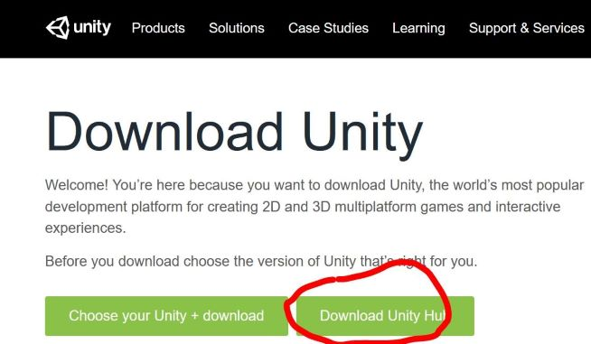

# Software Setup and Requirements for CS 2053

This course requires you to use the Unity Editor in your course work to create games. The editor does not run on a virtual machine, which means ***you must install Unity on your personal machine to be able to complete this course***.

- [See System Requirements to run Unity](https://docs.unity3d.com/Manual/system-requirements.html#editor)

## TL;DR

- We will be using Unity LTS 2019.4.XX
- Visual Studio Community 2019 is strongly suggested as an editor for Windows and Mac, Rider for Linux
- We will use GitHub for as much as possible in the class, and recommend using the GitHub Desktop for this

## Installing Unity and Visual Studio Community

Use the links and instructions below to install the correct version of Unity.

1. First, download and install ***Unity Hub*** (Unity Hub is a very useful tool for downloading version of the Unity Editor and selecting your projects): [follow this link to the download page and click the button on the right for Unity Hub](https://unity3d.com/get-unity/download). 
2. Run and install your Unity Hub download. More instructions on installing Unity Hub or customizing your install are [here](https://docs.unity3d.com/Manual/GettingStartedInstallingHub.html).
3. Once Unity Hub is installed, you will install the most recent LTS (Long-Term Support) version of Unity, which should be 2019.4.x (where the 'x' doesn't matter... it gets updated frequently).
   1. Run Unity Hub. Click "Installs" on the left-hand menu.
   2. Click the blue "Add" button.
   3. Select the latest official LTS Unity 2019.4.XXX (LTS) and click "Next"
   4. Next, we need to select the modules:
      - We will use **Microsoft Visual Studio Community 2019** as our editor, so select that option, if you don't already have it installed. It is free for Windows and Mac.
      - If you are on Linux you will need to find another editor, the only one officially supported for Unity on Linux is [Rider](https://www.jetbrains.com/rider/download/#section=linux), which is not free. However, you can get a free license from GitHub for Rider by signing up for the [GitHub Student Developer Pack](https://education.github.com/pack)
      - You can unselect every other module. 
        - You do not need to install the documentation (it is available online).
        - If you like, you can add build support, although, we won't need it for the class. If you do, you might just select build support for your platform, that way you can make your games standalone for your system.

## Create a GitHub Account

We will use GitHub extensively in this class to access code and submit assignments. This takes a little bit of learning to begin with, but it is well worth the little bit of effort. You will use the same account for everything in this class, so you might consider making a new account.

- Create an account on [GitHub](https://github.com/join?ref_cta=Sign+up&ref_loc=header+logged+out&ref_page=%2F&source=header-home) (if you don't already have one)

## Register your GitHub Account for the Class

Use the same account for everything you do in the class, so we can always track down your work:

- [Register your GitHub username here](https://forms.office.com/Pages/ResponsePage.aspx?id=0m5OJJoz80e5XORTUcGYt5Cv_Yazi1ZOk3ethx-h5lhUNjM2Q0lJSklOVkdISEI0T0dTRjRNSFhQVS4u)

## Install GitHub Desktop

We will use GitHub Desktop for get access to code and submitting your work. It can make using GitHub easier than the command line.

- [Download and Install GitHub Desktop](https://desktop.github.com/)
